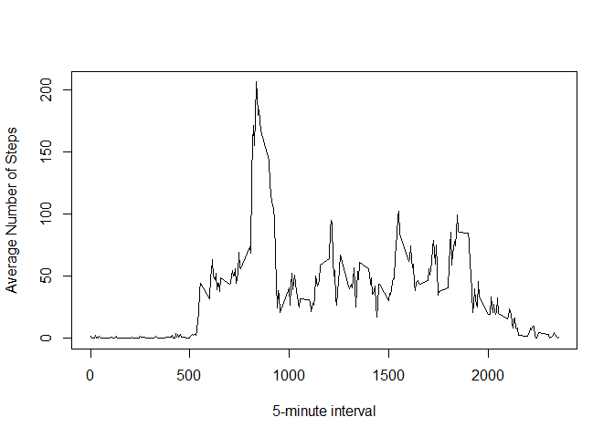

Reproducible Research: Peer Assessment 1
================

Loading Libraries
-----------------

``` r
library(dplyr)
library(lattice)
```

Loading and preprocessing the data
----------------------------------

``` r
dfActivity <- read.csv("activity.csv")
avg_Steps_by_Interval <- group_by(dfActivity, interval) %>% summarize(mean(steps, na.rm=TRUE))
names(avg_Steps_by_Interval) <- c("interval", "average_steps")
dfActivity$date <- as.Date(dfActivity$date, "%Y-%m-%d")
```

What is mean total number of steps taken per day?
-------------------------------------------------

``` r
totalStepsPerDay <- tapply(dfActivity$steps, dfActivity$date, sum)
```

#### Make a histogram of the total number of steps taken each day

``` r
hist(totalStepsPerDay, main ="Frequency Distribution of Total Steps Per Day", xlab="Steps Per Day", breaks = 6)
```


#### Calculate and report the mean and median of the total number of steps taken per day

``` r
print(paste("The mean of the imputed steps per day is", as.character(mean(totalStepsPerDay, na.rm = TRUE))))
```

    ## [1] "The mean of the imputed steps per day is 10766.1886792453"

``` r
print(paste("The median of the imputed steps per day is", as.character(median(totalStepsPerDay, na.rm = TRUE))))
```

    ## [1] "The median of the imputed steps per day is 10765"

What is the average daily activity pattern?
-------------------------------------------

#### Make a time series plot (i.e. type = "l") of the 5-minute interval (x-axis) and the average number of steps taken, averaged across all days (y-axis)

``` r
with(avg_Steps_by_Interval, plot(interval, average_steps, type='l', xlab='5-minute interval', ylab='Average Number of Steps'))
```



#### Which 5-minute interval, on average across all the days in the dataset, contains the maximum number of steps?

``` r
max_interval <- avg_Steps_by_Interval[avg_Steps_by_Interval$average_steps == max(avg_Steps_by_Interval$average_steps) , ]
paste("The maximum average number of steps", as.character(max_interval[1,2]), "occurs during interval", as.character(max_interval[1,1]))
```

    ## [1] "The maximum average number of steps 206.169811320755 occurs during interval 835"

Imputing missing values
-----------------------

#### Calculate and report the total number of missing values in the dataset (i.e. the total number of rows with NAs)

``` r
paste("There are", nrow(dfActivity[is.na(dfActivity$steps),]), "rows of missing steps data")
```

    ## [1] "There are 2304 rows of missing steps data"

#### Devise a strategy for filling in all of the missing values in the dataset. The strategy does not need to be sophisticated. For example, you could use the mean/median for that day, or the mean for that 5-minute interval, etc.

My approach is to use the average number of steps by interval calculated above to impute the missing step data

#### Create a new dataset that is equal to the original dataset but with the missing data filled in.

``` r
dfActivity <- merge(dfActivity, avg_Steps_by_Interval, by.x = "interval", by.y= "interval")
dfActivity$steps[is.na(dfActivity$steps) ] <- dfActivity$average_steps[is.na(dfActivity$steps) ]
```

#### Make a histogram of the total number of steps taken each day and Calculate and report the mean and median total number of steps taken per day. Do these values differ from the estimates from the first part of the assignment?

``` r
totalStepsPerDayImputed <- tapply(dfActivity$steps, dfActivity$date, sum)

hist(totalStepsPerDayImputed, main ="Frequency Distribution of Total Steps Per Day", xlab="Steps Per Day", breaks=6)
```


``` r
print(paste("The mean of the imputed steps per day is", as.character(mean(totalStepsPerDayImputed))))
```

    ## [1] "The mean of the imputed steps per day is 10766.1886792453"

``` r
print(paste("The median of the imputed steps per day is", as.character(median(totalStepsPerDayImputed))))
```

    ## [1] "The median of the imputed steps per day is 10766.1886792453"

#### What is the impact of imputing missing data on the estimates of the total daily number of steps?

The impact of imputing the missing data with the daily average is to align the median with the mean

Are there differences in activity patterns between weekdays and weekends?
-------------------------------------------------------------------------

#### Create a new factor variable in the dataset with two levels – “weekday” and “weekend” indicating whether a given date is a weekday or weekend day.

``` r
dfActivity <- mutate(dfActivity, day_type = factor((weekdays(date) %in% c("Saturday", "Sunday")), labels = c("Weekday", "Weekend")))
```

#### Make a panel plot containing a time series plot (i.e. type = "l") of the 5-minute interval (x-axis) and the average number of steps taken, averaged across all weekday days or weekend days (y-axis). See the README file in the GitHub repository to see an example of what this plot should look like using simulated data.

``` r
avg_Steps_by_Interval <- group_by(dfActivity, interval, day_type) %>% summarize(mean(steps))
names(avg_Steps_by_Interval) <- c("interval", "day_type", "average_steps")
xyplot(average_steps ~ interval | day_type, data = avg_Steps_by_Interval, layout = c(1,2), type="l", ylab="Average Steps")
```


